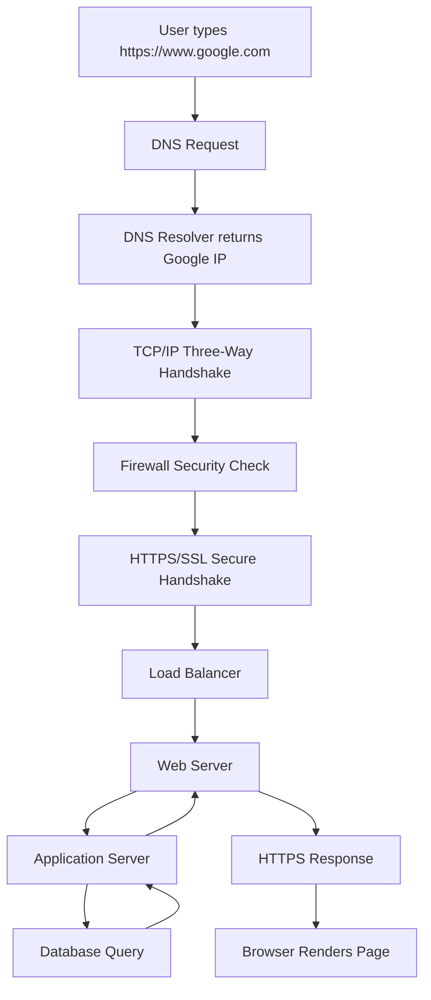

---

# 1. Everything's better with a pretty diagram

```mermaid
flowchart TD
    A[User types https://www.google.com] --> B[DNS Request]
    B --> C[DNS Resolver returns Google IP]
    C --> D[TCP/IP Three-Way Handshake]
    D --> E[Firewall Security Check]
    E --> F[HTTPS/SSL Secure Handshake]
    F --> G[Load Balancer]
    G --> H[Web Server]
    H --> I[Application Server]
    I --> J[Database Query]
    J --> I
    I --> H
    H --> K[HTTPS Response]
    K --> L[Browser Renders Page]
```
